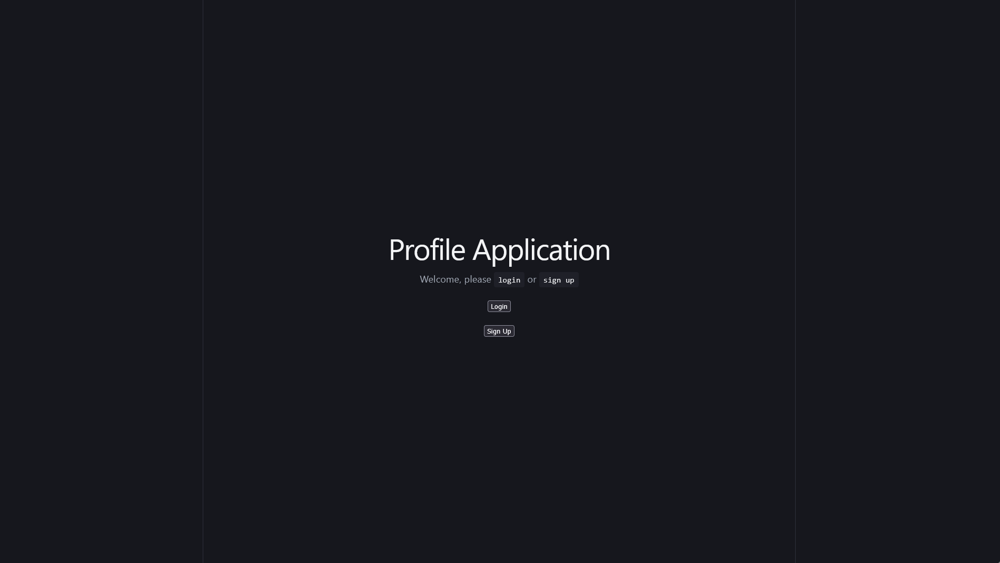
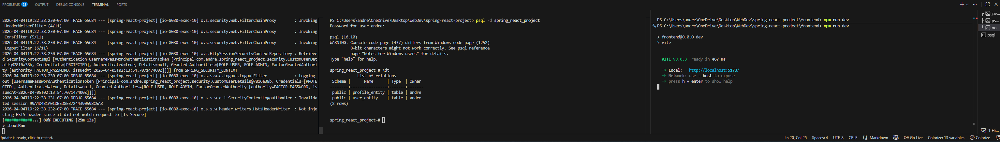
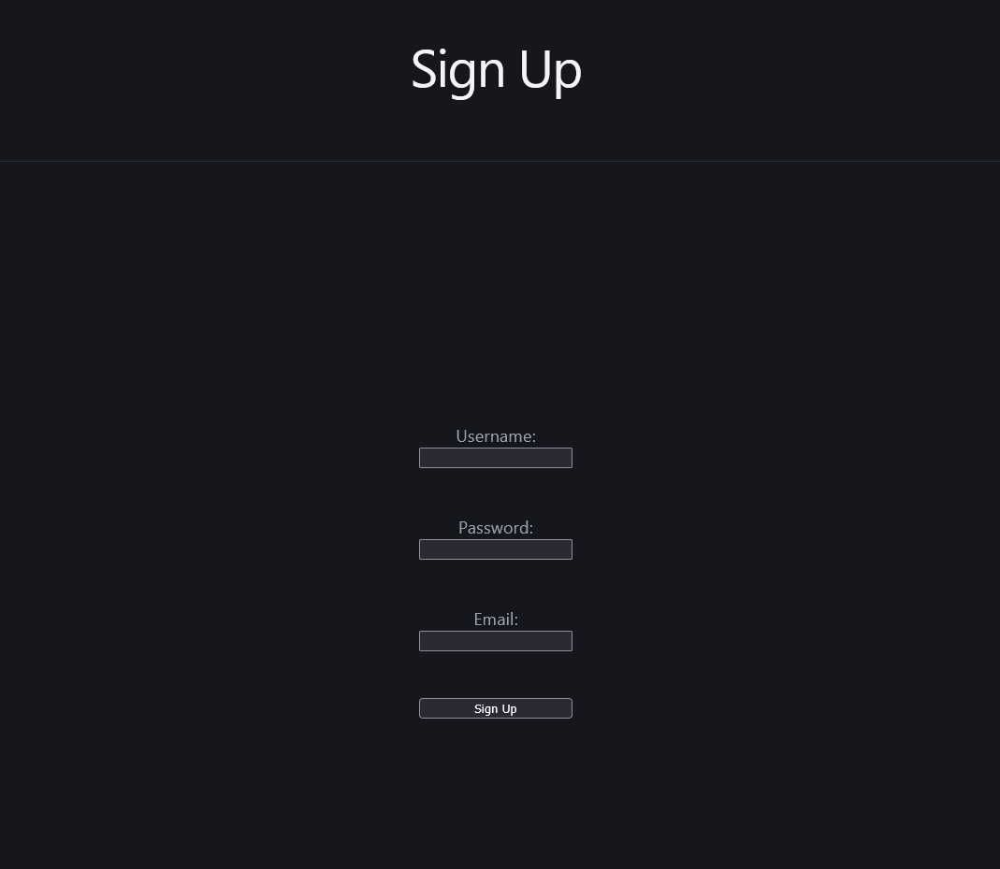
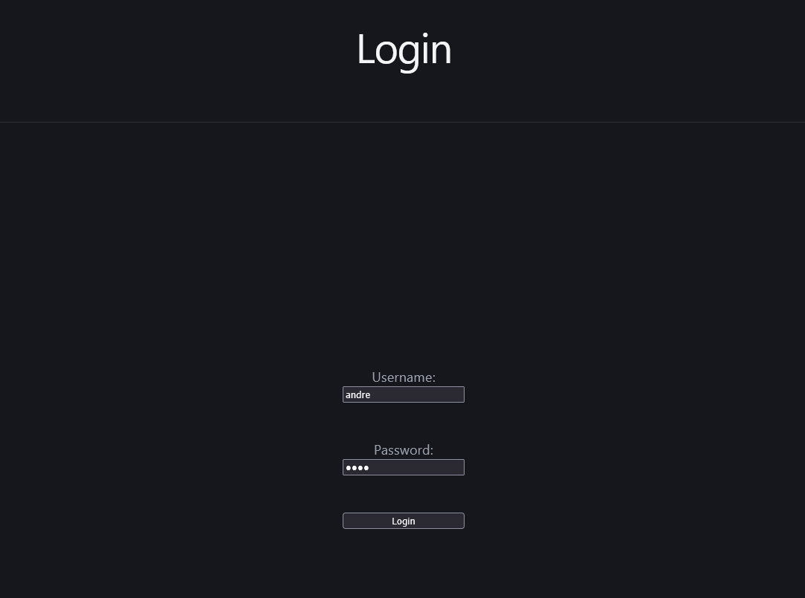
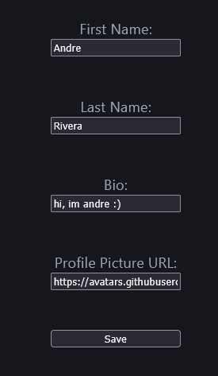
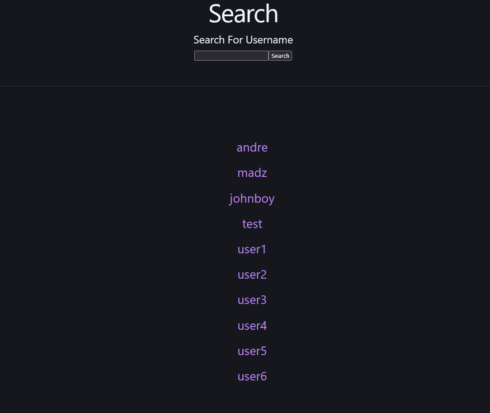
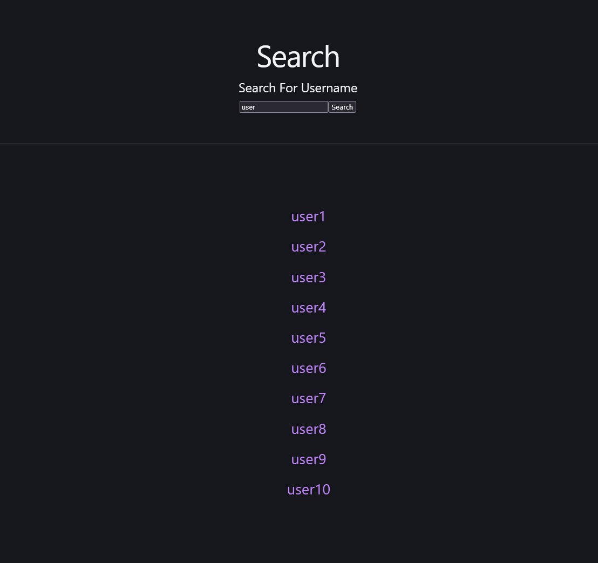

# User Account Project

## Project Overview
The following project is a simple full-stack application built with a Spring Boot + PostgresSQL backend and a ViteJS frontend. The purpose of this project was to experiment with combining the security features of Spring Security and the database management features of Spring Data JPA. Additionally, I wanted to create a simple frontend interface in where I could call my backend API and have it manipulate the database in real time. The result of all these technologies is a basic application where users can register/login accounts, edit account information, and search for the accounts of other users.

### Technologies Used

- Java 21
- Spring Boot
- Spring Security
- Spring Data JPA
- Spring PostgresSQL Driver
- NodeJS 22
- ViteJS
- PostgresSQL 16.10

## Quickstart
All terminal commands referenced start at the local directory of this repository.

### Dependencies

- PostgresSQL 16.10 (or any higher version), must have a database named `spring_react_project`
- Java 21 SDK
- Node.js 22.12 (or any higher version)

### Instructions

1) Edit setup file in `backend\src\main\resources\application.yaml` and change the username/password to match your postgresSQL user details.
   - Setting this up gives the backend access to postgresSQL and allows it to manipulate the database
2) Use `psql -U postgres` and login to postgres. Run the `CREATE DATABASE spring_react_project` command to create the database necessary for this project.
3) Use `psql -d spring_react_project` to access the database.
4) Open a new terminal. Use `cd backend; ./gradlew bootrun` to compile and run the spring boot application.
5) Open a new terminal. Use `cd frontend; npm run dev` to compile and run the web project

By the end, you should have three terminals running.

## Features
The frontend of the application can be accessed on http://localhost:5173 (default)

The backend of the application can be accessed on http://localhost:8080 (default)

It should be noted that a majority of the backend API requires authorization via a user account to access. If testing on the backend, it is recommended to first use the login endpoint at http://localhost:8080/login so that your http session can be authorized (valid cookie).

### User Account Creation
One primary feature of the application is the ability to create your own user account which is stored on the backend DB and secured with Spring Security. To create an account, navigate to the signup page at http://localhost:5173/signup and enter your username, password, and email. After successful creation, you can now login to your account

### User Account Login
Once you have signed up, you can login via the signup page at http://localhost:5173/login by entering your username and password. Authentication, authorization, and encryption for these accounts is handled by Spring Security.

### User Profiles & Editing
Upon login, you will be greeted with the dashboard which displays basic information about the user. By default, it will have basic values.

Your profile can be edited using the Set Profile button on the bottom right. This allows edit your text, name, bio, and profile picture. At the moment, there is no way to upload an image so you must find a place to host it and paste in the image link URL.

### User Searching
Logged-in users can also search for the profiles of other users using the search function. This can be accessed at http://localhost:5173/search or by clicking the Search button on the dashboard. You can search for a specific username using the search bar and search button.

Clicking on a displayed username brings you to their profile.

### User Logout
Once you are done with the application, simply navigate back to your dashboard and click the logout button! Doing so will immediately end your session and Spring Security will log you out.

