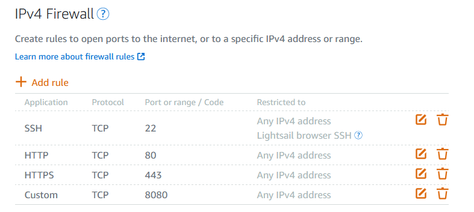
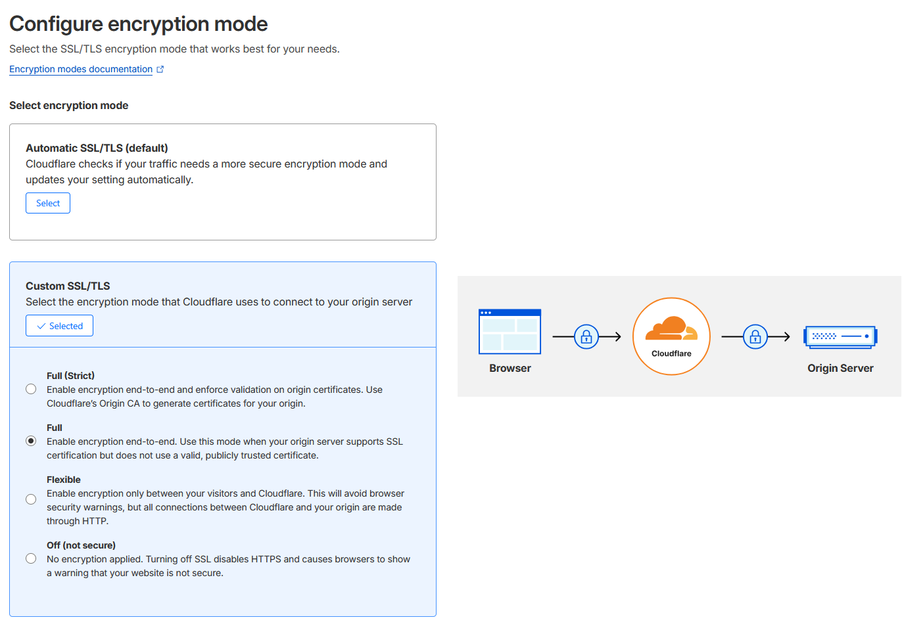
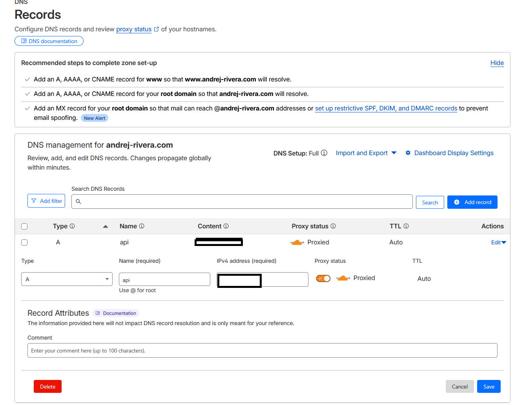
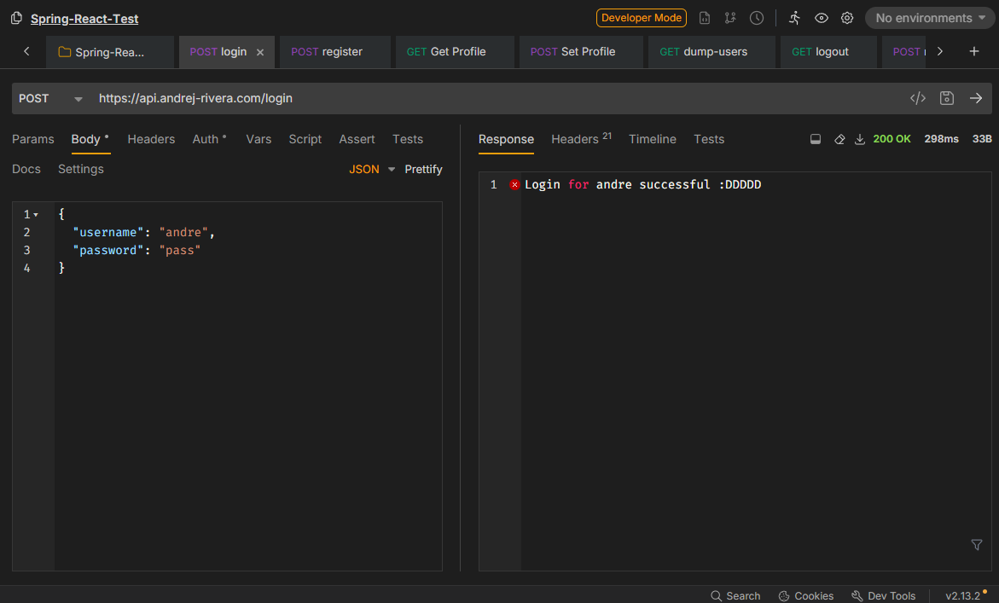
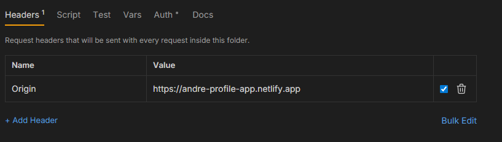
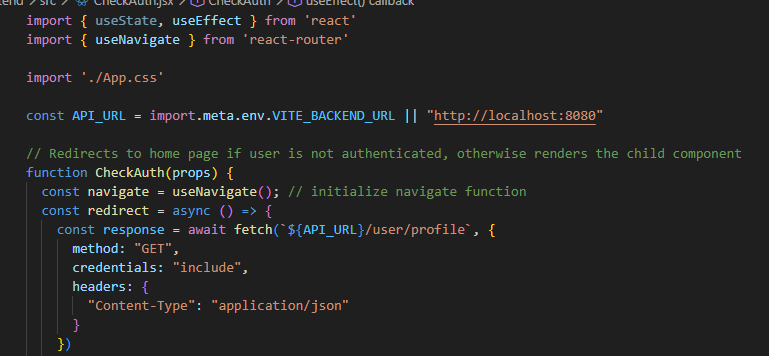
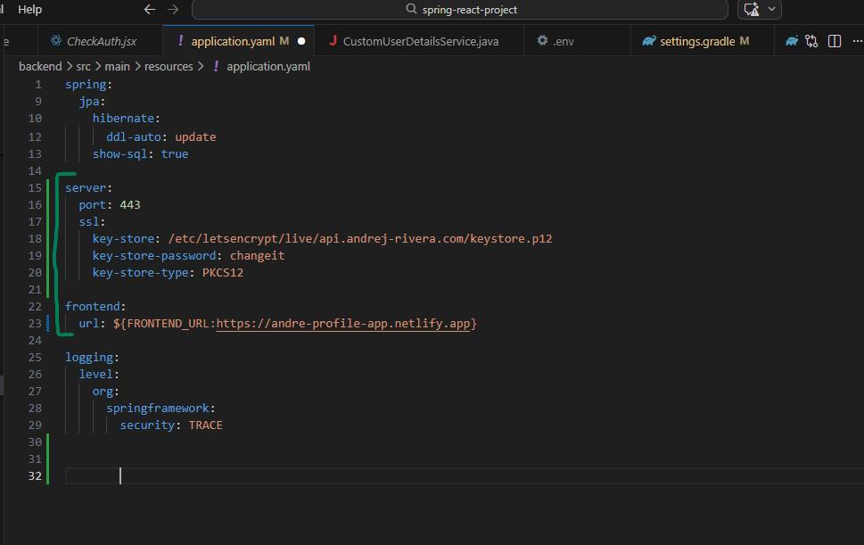
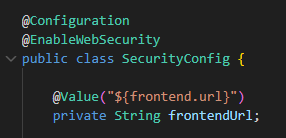
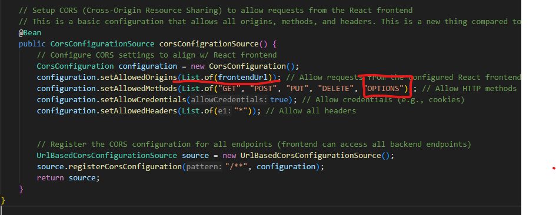
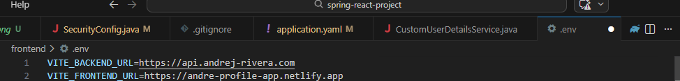

# Production Branch
The following branch is meant for production and contains adjusted settings/environmental variables. The backend for this project (Spring Boot App + PostgreSQL DB) is hosted on an Amazon Lightsail Instance running Amazon Linux 2. The frontend for this project is hosted on Netlify. Below, you will see a comprehensive list of instructions and changes that I made to the project in order to host it on those platforms.

## Project Overview
The following project is a simple full-stack application built with a Spring Boot + PostgresSQL backend and a ViteJS frontend. The purpose of this project was to experiment with combining the security features of Spring Security and the database management features of Spring Data JPA. Additionally, I wanted to create a simple frontend interface in where I could call my backend API and have it manipulate the database in real time. The result of all these technologies is a basic application where users can register/login accounts, edit account information, and search for the accounts of other users.

### Technologies Used

- Java 21
- Spring Boot
- Spring Security
- Spring Data JPA
- Spring PostgresSQL Driver
- NodeJS 22
- ViteJS
- PostgresSQL 16.10

# Production
Production consists of two parts, backend and frontend. I will be covering the instructions for both below.
I've omitted the specific commands required as they might vary depending on your OS and future requirements, this leaves just the general process (which is still pretty lengthy).

## Hosting the Backend

### Requirements
- PostgresSQL 16.10 (or any higher version), must have a database named `spring_react_project`
- Java 21 SDK
- Amazon LightSail Instance
- A registered domain

---

### Setting up the Lightsail Environment

The first stage of setting up the backend involves configuring and setting up the Amazon Lightsail instance from scratch. The setup is as follows:

1) Start an Amazon Lightsail instance with either Amazon Linux 2 or Ubuntu.
2) On the Lightsail instance, install Java 21 and PostgreSQL.
3) Next, create the necessary databases and users using psql. By default, the user:pass combo defined is `andre:pass` and the default database name is `spring_react_project`. Create the database using the `psql` command and make sure to assign the database owner to the proper user.
4) In the `./backend` folder, run `.\gradlew.bat` bootJar to compile the Spring Boot backend.
   - The jar file produced will be located in `./backend/build/libs`
5) Move the jar file produced by the command into the Lightsail instance either by using an SSH client such as winSCP or over SSH with the `scp` command.
6) The backend can now be fully run using the command `sudo nohup java -jar [jar file name] &`

**Note:** To kill the backend process, you need to find it using `ps aux | grep java` and then use the `kill [process-id]` command. You should kill the process whenever you make a change to the spring boot application and have to update the .jar file.

---
### Networking

After configuring the Lightsail environment, we need to open up the ports for the instance so that websites can communicate with it.

1) On the Amazon Lightsail dashboard, go to the networking tab and create a static ip for the instance. This will be the IP that you can connect to for HTTP calls.
2) Next, add the following firewall rules.
    - 
    - From here, the backend should be running smoothly. You can test if the API works via curl HTTP requests.

---
### SSL Certificate & Domain Setup

The final thing we need to do for the backend is setup the SSL certificate so that HTTPS requests can be made to it. This isn't really necessary for regular cases because you can just send regular HTTP requests to the backend. However, if you are using a frontend provider like Netlify or Vercel, they force all HTTP requests to be HTTPS which means that our backend needs to have a valid HTTPS certificate if we want to send responses back.

For this step, you should have a valid domain registered somewhere. In this case, I have a domain that is registered to Cloudflare so I will be writing down the steps I used to have my domain work through there.

1) Register your domain (Cloudflare, Amazon Route 53, ...)
2) Configure your domain and ensure it accepts SSL encryption
   - 
3) Have your domain act as a proxy for the Lightsail public IP (IPv4) address.
   - Keep note as to what port is proxied. For cloudflare, it's port 443 so I make sure that my Spring Boot Application is open on port 443.
   - 
4) On the Lightsail instance, install certbot and run it. It will give you simple instructions to certify your domain and install the certification.
5) Reconfigure the Spring Boot application and make sure that it can access the certificate.
    - 
6) Once complete, your backend application should be good to go! Make sure that the CORS configuration on Spring Boot accepts requests from your frontend. If not, simply edit your CORS configuration in the `SecurityConfig.java` file and then re-jar & restart your backend application.
   - You can further test the backend API by sending HTTPS requests to the proxied backend domain with the header `Origin: https://frontend-link.com`.

## Hosting the Frontend
Compared to the backend, hosting the frontend on Netlify is much easier.

### Requirements
- A Netlify Account
- GitHub repository for frontned
- Thats it :)

---

### Setup
1) Before setting up on Netlify, ensure that all API calls to the backend use the new proxied API link we setup earlier.
    - To do this easily, I setup a simple .env file so that all fetch requests on the frontend can just refer to the .env file for the backend instead of hard-coding the link every time. Note that you do not need to push the .env to your repository.
    - 
2) Publish the project on GitHub.
3) On Netlify, start a new web project. Select the new repository as the base.
4) Setup the build settings
    - For ViteJS, the build command is `npm run build`
    - Additionally, the publish directory is `/dist`
    - In the environmental variables section, you can just copy/paste the .env file and it will set it up for you.
5) Deploy & Test!

I'm sure that if I were to use a cloud computing service to host my frontend, it'd be much harder to setup. For now, a simple provider like Netlify or Vercel is good enough for me.

## Major Changes to Files
To configure this project for production, I made a few changes to the backend and frontend. The exact changes made are listed below:

### Backend

#### `application.yaml`

**Main Changes**

- Open spring boot port on 443 instead of default 8080 (cloudflare proxy directs traffic to :443).
- Add ssl section so that Spring Boot can utilize the SSL certificate.
- Give application.yaml the ability to store the frontend-url so that it's easier to change (similar function to our .env file).

 

#### `SecurityConfig.java`

**Main Changes**

- import frontend-url from our `application.yaml` file and have CORS use it
- allow "OPTIONS" as a valid CORS method (required)

---

### Frontend

#### `.env`

**Main Changes**

- Contains the backend API url so that it's easier to change for the entire project.
- Also contains the frontend url cause why not

 

#### `All components that have a fetch request`

**Main Changes**

- For fetch requests, the frontend now pulls the backend-url from the .env file. This means than changing the link in the .env file changes it for the whole project. yipeee.

